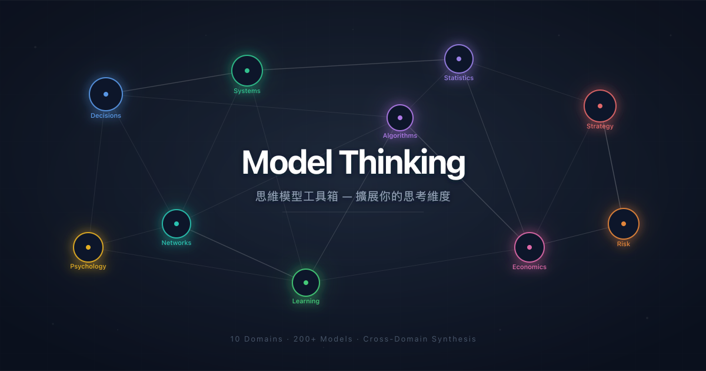
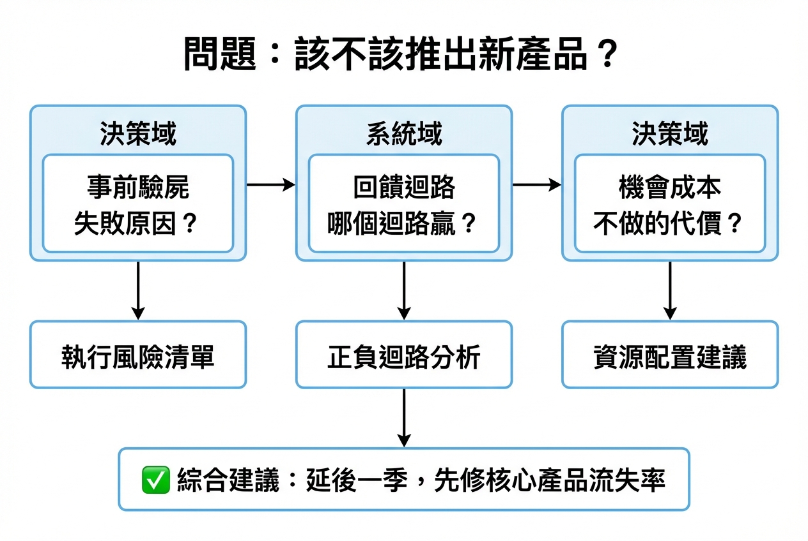
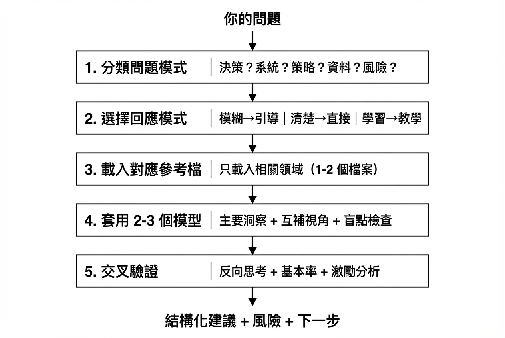

<div align="center">



<br/>
<br/>

[](LICENSE)
[](#-相容的-ai-agent)
[](#-十大知識領域)
[](#-十大知識領域)
[](#-前置條件)

**把 200+ 個思維模型裝進你的 AI 助手，系統性擴展你的思考維度。**

[快速安裝](#-快速安裝) · [使用範例](#-你可以怎麼用) · [十大領域](#-十大知識領域) · [運作原理](#️-運作原理)

</div>

---

你做決策時，是靠直覺，還是有一套系統？

大多數人面對複雜問題時，只會用自己最熟悉的那一兩個角度去想。結果不是盲點太大，就是想了半天原地打轉。

**Model Thinking** 讓你的 AI 助手成為一個裝備了 200+ 個思維模型的思考夥伴。不是給你一份模型清單讓你自己讀——而是根據你的問題，即時挑選 2-3 個最合適的模型，從不同領域交叉分析，幫你看見自己看不見的角度。

## ⚡ 快速安裝

```bash
npx skills add kcchien/model-thinking
```

就這樣。當你請 AI 助手幫你分析問題、做決策、或學習思維模型時，它會自動啟用。

## 💬 你可以怎麼用？

用自然語言跟你的 AI 助手對話即可：

| 你說 | 發生什麼事 |
|------|-----------|
| *「A 公司開年薪 200 萬但要 relocate，B 公司 150 萬但能遠端，怎麼選？」* | 用可逆性、機會成本、10/10/10 法則交叉分析兩個選項的長期影響 |
| *「我們的客服工單量每季都翻倍，加人卻沒改善」* | 用系統基模（轉嫁負擔 + 成長極限）找出加人只是症狀處理的根因 |
| *「越南半導體廠用水市場，我們該第一個進去嗎？」* | 用先行者優勢、網路效應、肥尾風險三角驗證，給出進入策略與下注規模 |
| *「教我什麼是二階思考，用產品定價當例子」* | 教學模式：概念定義 → 定價的一階/二階/三階效應 → 常見陷阱 → 練習題 |
| *「用 Pre-Mortem 分析我們 Q3 的產品上線計畫」* | 直接套用事前驗屍法，列出「已經失敗了，為什麼？」的風險清單 |
| *「團隊要決定技術棧，五個人五種意見，怎麼收斂？」* | 引導模式：先釐清決策可逆性與關鍵權重，再用加權決策矩陣 + 六頂思考帽結構化討論 |

### 三種模式，自動適配

| 模式 | 觸發條件 | 你會得到什麼 |
|------|---------|------------|
| **引導模式** | 問題模糊或複雜 | 2-3 個診斷問題 → 模型推薦 → 結構化分析 |
| **直接模式** | 問題清楚或指定模型 | 立即套用 2-3 個模型，交叉驗證 |
| **教學模式** | 想學習特定模型 | 一句話定義 → 具體範例 → 常見陷阱 → 練習題 |

你不需要知道哪個模型適用——描述你的問題，AI 會自動選擇。

## 🧠 十大知識領域

不只是模型清單，而是一套有組織的**思考工具箱**。每個領域獨立成冊，AI 按需載入，不浪費上下文視窗。

| 領域 | 涵蓋主題 | 代表模型 |
|------|---------|---------|
| **決策** (Decisions) | 選擇、判斷、認知工具 | 反向思考、二階效應、事前驗屍、六頂思考帽 |
| **系統** (Systems) | 回饋迴路、湧現、干預 | 存量與流量、槓桿點、成長極限、轉嫁負擔 |
| **統計** (Statistics) | 機率、推論、謬誤 | 貝氏思維、回歸均值、倖存者偏差、辛普森悖論 |
| **策略** (Strategy) | 賽局、競爭、談判 | 納許均衡、囚徒困境、BATNA、護城河 |
| **心理** (Psychology) | 偏誤、社會心理、動機 | 確認偏誤、損失趨避、從眾效應、鄧寧-克魯格 |
| **網路** (Networks) | 連結、影響力、平台 | 網路效應、梅特卡夫定律、小世界、弱連結 |
| **演算法** (Algorithms) | 計算思維、搜尋、排序 | 探索/利用、模擬退火、貪心法、快取策略 |
| **風險** (Risk) | 不確定性、脆弱性、黑天鵝 | 肥尾分佈、反脆弱、安全邊際、槓鈴策略 |
| **學習** (Learning) | 知識獲取、技能建構 | 間隔重複、刻意練習、費曼技巧、能力圈 |
| **經濟** (Economics) | 市場、激勵、資源配置 | 機會成本、供需、比較優勢、公地悲劇 |

### 跨領域組合 — 真正的威力所在

單一模型只看到一個面向。**Model Thinking** 的核心價值是跨領域組合：



模型之間**同意** = 高信心。模型之間**不同意** = 值得深挖的複雜性。

## ⚙️ 運作原理

**漸進式揭露架構** — AI 不會一次載入所有模型，而是按需取用：

| 階段 | 載入什麼 | 上下文成本 |
|------|---------|-----------|
| 待機 | 技能名稱 + 觸發描述 | ~100 詞 |
| 啟動 | SKILL.md 核心工作流 | ~800 詞 |
| 分析 | 相關領域的參考檔（1-2 個） | ~3,000 詞/檔 |
| 組合 | combinations.md（按需） | ~2,000 詞 |

這代表你的上下文視窗不會被用不到的模型塞滿。AI 只讀它需要的東西。

### 分析流程



## 📁 技能結構

```
model-thinking/
├── SKILL.md                        # AI 指令入口（工作流 + 模板 + 路由表）
└── references/
    ├── decisions.md                # 決策模型（25 個）
    ├── systems.md                  # 系統模型（24 個）
    ├── statistics.md               # 統計模型
    ├── strategy.md                 # 策略模型
    ├── psychology.md               # 心理模型（27 個）
    ├── networks.md                 # 網路模型
    ├── algorithms.md               # 演算法模型
    ├── risk.md                     # 風險模型
    ├── learning.md                 # 學習模型
    ├── economics.md                # 經濟模型
    └── combinations.md             # 跨領域組合策略（5 個情境範例）
```

## 🤝 相容的 AI Agent

| Agent | 安裝方式 |
|-------|---------|
| [Claude Code](https://docs.anthropic.com/en/docs/claude-code) | `npx skills add kcchien/model-thinking` |
| 其他相容 Agent | 任何能讀取 `SKILL.md` 作為指令的 AI Agent |

> Model Thinking 遵循開放的 `SKILL.md` 慣例。任何能發現並載入 `SKILL.md` 的 AI Agent 都能使用。

## 📋 前置條件

- 支援 Agent Skills 的 AI 編碼助手（例如 [Claude Code](https://docs.anthropic.com/en/docs/claude-code)）
- **零額外依賴** — 不需要 Python、不需要 API key、不需要安裝任何套件

## 📖 附錄：完整模型清單（253 個）

<details>
<summary><strong>決策 (Decisions) — 25 個</strong></summary>

Inversion · Second-Order Thinking · Probabilistic Thinking · Expected Value · Regret Minimization · Pre-Mortem · Two-Way vs One-Way Door · Circle of Competence · Occam's Razor · Hanlon's Razor · First Principles Thinking · Falsifiability · Devil's Advocate · Six Thinking Hats · Opportunity Cost · Marginal Thinking · Sunk Cost Fallacy · Asymmetric Risk-Reward · Satisficing vs Maximizing · Temporal Discounting · Commitment Devices · Option Value · Weighted Decision Matrix · 10/10/10 Rule · WRAP Framework

</details>

<details>
<summary><strong>系統 (Systems) — 24 個</strong></summary>

Stocks and Flows · System Boundaries · Hierarchy and Subsystems · Resilience · Reinforcing Feedback Loops · Balancing Feedback Loops · Delays · Dominance Shifting · Oscillation · Exponential Growth · Emergence · Non-linearity · Chaos and Sensitivity · Attractors · Path Dependence · Self-Organization · Adaptive Systems · Leverage Points · Unintended Consequences · Policy Resistance · Shifting the Burden · Fixes That Fail · Limits to Growth · Tragedy of the Commons

</details>

<details>
<summary><strong>統計 (Statistics) — 25 個</strong></summary>

Bayes' Theorem · Base Rates · Conditional Probability · Independence · Law of Large Numbers · Expected Value · Normal Distribution · Power Laws · Fat Tails · Regression to the Mean · Simpson's Paradox · Survivorship Bias · Signal vs Noise · Confidence Intervals · Correlation vs Causation · Selection Bias · Overfitting · Sample Size Effects · Multiple Comparisons Problem · Gambler's Fallacy · Hot Hand Fallacy · Neglect of Probability · Conjunction Fallacy · Denominator Neglect · Availability Heuristic

</details>

<details>
<summary><strong>策略 (Strategy) — 26 個</strong></summary>

Nash Equilibrium · Prisoner's Dilemma · Zero-Sum vs Positive-Sum · Repeated Games · Tit-for-Tat · Chicken Game · Stag Hunt · Moats · Porter's Five Forces · Relative vs Absolute Advantage · First-Mover vs Fast-Follower · Blue Ocean Strategy · Disruptive Innovation · Red Queen Effect · BATNA · ZOPA · Integrative vs Distributive Bargaining · Anchoring in Negotiation · Commitment and Consistency · Reciprocity · Schelling Points · Commitment Devices · Signaling · Information Asymmetry · Option Value in Strategy · Precommitment

</details>

<details>
<summary><strong>心理 (Psychology) — 27 個</strong></summary>

Confirmation Bias · Availability Heuristic · Anchoring · Hindsight Bias · Overconfidence · Dunning-Kruger Effect · Status Quo Bias · Framing Effects · Loss Aversion · Peak-End Rule · Recency and Primacy Effects · Halo Effect · Fundamental Attribution Error · Representativeness Heuristic · Social Proof · Authority Bias · Liking Bias · Commitment and Consistency · In-Group/Out-Group Bias · Groupthink · Bystander Effect · Incentive-Caused Bias · Reactance · Hedonic Treadmill · Maslow's Hierarchy · Self-Serving Bias · Sunk Cost Fallacy

</details>

<details>
<summary><strong>網路 (Networks) — 25 個</strong></summary>

Nodes and Edges · Network Density · Degree Distribution · Hub Nodes · Network Clustering · Bridges and Structural Holes · Strong vs Weak Ties · Small World Networks · Preferential Attachment · Network Effects · Critical Mass · Tipping Points · Cascade Failures · Social Contagion · Information Cascade · Viral Spread · Seeding Strategies · Echo Chambers · Dunbar's Number · Two-Sided Markets · Multi-Sided Platforms · Switching Costs and Lock-In · Disintermediation · Network Orchestration · Ecosystem Strategy

</details>

<details>
<summary><strong>演算法 (Algorithms) — 25 個</strong></summary>

Optimal Stopping (37% Rule) · Look-Then-Leap Rule · Secretary Problem Variants · Multi-Armed Bandit · Explore/Exploit Trade-off · Gittins Index · Comparison Sorts · Bucket Sort · Search Costs · LRU Cache · Noguchi Filing System · Earliest Due Date · Shortest Job First · Weighted Shortest Job First · Priority Inversion · Interrupt Coalescing · Context Switching Costs · Thrashing · Gradient Descent · Simulated Annealing · Hill Climbing · Randomness in Optimization · Relaxation · Constraint Satisfaction · Lagrangian Relaxation

</details>

<details>
<summary><strong>風險 (Risk) — 25 個</strong></summary>

Risk vs Uncertainty · Aleatory vs Epistemic Uncertainty · Known Knowns Matrix · Calibrated Uncertainty · Ergodicity · Fragile · Robust · Antifragile · Hormesis · Via Negativa · Black Swans · Fat Tails vs Thin Tails · Ludic Fallacy · Turkey Problem · Extremistan vs Mediocristan · Precautionary Principle · Margin of Safety · Barbell Strategy · Redundancy · Position Sizing · Asymmetric Payoffs · Skin in the Game · Small Bets · Reversibility Premium · Correlation in Crisis

</details>

<details>
<summary><strong>學習 (Learning) — 25 個</strong></summary>

Circle of Competence · T-Shaped Knowledge · Spacing Effect · Testing Effect · Interleaving · Elaboration · Dual Coding · Deliberate Practice · 10,000 Hour Rule · Competence Ladder · Plateau Effect · Transfer of Learning · Zeigarnik Effect · Growth vs Fixed Mindset · Desirable Difficulties · Fail Fast, Learn Fast · Antifragility in Learning · Explore/Exploit Trade-off · Compounding Knowledge · Feynman Technique · Analogical Reasoning · Scaffolding · Cognitive Load Theory · Zone of Proximal Development · Chunking

</details>

<details>
<summary><strong>經濟 (Economics) — 26 個</strong></summary>

Supply and Demand · Opportunity Cost · Marginal Thinking · Comparative Advantage · Diminishing Returns · Economies of Scale · Invisible Hand · Creative Destruction · Externalities · Market Failure · Price Elasticity · Arbitrage · Bubbles and Crashes · Incentives · Principal-Agent Problem · Moral Hazard · Adverse Selection · Tragedy of the Commons · Free Rider Problem · Subjective Value · Price Discrimination · Bundling · Network Effects · Two-Sided Markets · Switching Costs · Auctions and Price Discovery

</details>

## 📄 授權

[MIT](LICENSE)

---

<div align="center">


# Model Thinking

**200+ mental models in your AI assistant. Think wider, decide better.**

<br/>

[](LICENSE)
[](#-compatible-agents)
[](#-ten-knowledge-domains)
[](#-ten-knowledge-domains)
[](#-requirements)

An AI-native thinking toolkit that equips your assistant with 200+ mental models<br/>
across 10 domains — with cross-domain synthesis for real-world problems.

[Quick Install](#-quick-install-1) · [Usage](#-what-can-you-do-with-it) · [Domains](#-ten-knowledge-domains) · [How It Works](#️-how-it-works-1)

</div>

---

When you face a complex decision, how many angles do you consider?

Most people rely on one or two familiar perspectives. The result: blind spots, circular thinking, or analysis paralysis.

**Model Thinking** turns your AI assistant into a thinking partner armed with 200+ mental models. It doesn't hand you a reading list — it selects 2-3 models that fit your specific problem, cross-references them across domains, and surfaces the angles you'd miss on your own.

## ⚡ Quick Install

```bash
npx skills add kcchien/model-thinking
```

That's it. Your AI agent will automatically activate when you ask it to analyze problems, make decisions, or learn about mental models.

## 💬 What Can You Do With It?

Just talk to your AI assistant naturally:

| You say | What happens |
|---------|-------------|
| *"Company A offers $150K but requires relocation; B offers $120K remote. How to decide?"* | Cross-analyzes with Reversibility, Opportunity Cost, and 10/10/10 Rule for long-term impact |
| *"Our support tickets double every quarter — hiring more agents isn't helping"* | Diagnoses with system archetypes (Shifting the Burden + Limits to Growth) to find the real bottleneck |
| *"Vietnam semiconductor fab water market — should we be first in?"* | Triangulates First Mover Advantage, Network Effects, and Fat Tail Risk; recommends entry strategy and bet size |
| *"Teach me second-order thinking using product pricing as the example"* | Teaching mode: definition → first/second/third-order effects of pricing → common pitfalls → practice prompt |
| *"Run a Pre-Mortem on our Q3 product launch plan"* | Directly applies Pre-Mortem: "It's 6 months later and we failed — why?" risk inventory |
| *"Team needs to pick a tech stack — 5 people, 5 opinions. How to converge?"* | Guided mode: clarifies reversibility and key criteria, then applies Weighted Decision Matrix + Six Thinking Hats |

### Three Modes, Auto-Selected

| Mode | Trigger | What You Get |
|------|---------|-------------|
| **Guided** | Ambiguous or complex problem | 2-3 diagnostic questions → model recommendations → structured analysis |
| **Direct** | Clear problem or specific model requested | Immediate 2-3 model application with cross-validation |
| **Teaching** | Wants to learn a model | One-liner → concrete example → common pitfall → practice prompt |

You don't need to know which model to use — describe your problem, and the AI selects automatically.

## 🧠 Ten Knowledge Domains

Not just a model catalog, but an organized **thinking toolkit**. Each domain is a separate reference file, loaded on demand to preserve your context window.

| Domain | Topics | Representative Models |
|--------|--------|----------------------|
| **Decisions** | Choice, judgment, cognitive tools | Inversion, Second-Order Thinking, Pre-Mortem, Six Thinking Hats |
| **Systems** | Feedback loops, emergence, intervention | Stocks & Flows, Leverage Points, Limits to Growth, Shifting the Burden |
| **Statistics** | Probability, inference, fallacies | Bayesian Thinking, Regression to Mean, Survivorship Bias, Simpson's Paradox |
| **Strategy** | Game theory, competition, negotiation | Nash Equilibrium, Prisoner's Dilemma, BATNA, Moats |
| **Psychology** | Biases, social psychology, motivation | Confirmation Bias, Loss Aversion, Social Proof, Dunning-Kruger |
| **Networks** | Connections, influence, platforms | Network Effects, Metcalfe's Law, Small Worlds, Weak Ties |
| **Algorithms** | Computational thinking, search, sorting | Explore/Exploit, Simulated Annealing, Greedy, Caching |
| **Risk** | Uncertainty, fragility, black swans | Fat Tails, Antifragile, Margin of Safety, Barbell Strategy |
| **Learning** | Knowledge acquisition, skill building | Spaced Repetition, Deliberate Practice, Feynman Technique, Circle of Competence |
| **Economics** | Markets, incentives, resource allocation | Opportunity Cost, Supply & Demand, Comparative Advantage, Tragedy of the Commons |

### Cross-Domain Synthesis — Where the Real Power Lives

A single model reveals one dimension. **Model Thinking**'s core value is cross-domain combination:

- **Models agree** → High confidence in the conclusion
- **Models disagree** → Hidden complexity worth exploring before deciding
- Each model's blind spot is covered by another's strength

The skill includes a dedicated `combinations.md` reference with battle-tested pairing strategies and five detailed scenario walkthroughs.

## ⚙️ How It Works

**Progressive disclosure architecture** — the AI doesn't load all models at once, but pulls them on demand:

| Stage | What Loads | Context Cost |
|-------|-----------|-------------|
| Standby | Skill name + trigger description | ~100 words |
| Activation | SKILL.md core workflow | ~800 words |
| Analysis | Relevant domain reference files (1-2) | ~3,000 words/file |
| Synthesis | combinations.md (on demand) | ~2,000 words |

Your context window stays clean. The AI only reads what it needs.

## 📁 Skill Structure

```
model-thinking/
├── SKILL.md                        # Agent instructions (workflow + templates + routing)
└── references/
    ├── decisions.md                # Decision models (25)
    ├── systems.md                  # Systems models (24)
    ├── statistics.md               # Statistics models
    ├── strategy.md                 # Strategy models
    ├── psychology.md               # Psychology models (27)
    ├── networks.md                 # Network models
    ├── algorithms.md               # Algorithm models
    ├── risk.md                     # Risk models
    ├── learning.md                 # Learning models
    ├── economics.md                # Economics models
    └── combinations.md             # Cross-domain combination strategies (5 scenarios)
```

## 🤝 Compatible Agents

| Agent | Install Method |
|-------|---------------|
| [Claude Code](https://docs.anthropic.com/en/docs/claude-code) | `npx skills add kcchien/model-thinking` |
| Other compatible agents | Any agent that reads `SKILL.md` as instructions |

> Model Thinking follows the open `SKILL.md` convention. Any AI agent that can discover and load `SKILL.md` files will work.

## 📋 Requirements

- An AI coding assistant that supports Agent Skills (e.g., [Claude Code](https://docs.anthropic.com/en/docs/claude-code))
- **Zero additional dependencies** — no Python, no API keys, no packages to install

## 📖 Appendix: Complete Model List (253)

<details>
<summary><strong>Decisions — 25</strong></summary>

Inversion · Second-Order Thinking · Probabilistic Thinking · Expected Value · Regret Minimization · Pre-Mortem · Two-Way vs One-Way Door · Circle of Competence · Occam's Razor · Hanlon's Razor · First Principles Thinking · Falsifiability · Devil's Advocate · Six Thinking Hats · Opportunity Cost · Marginal Thinking · Sunk Cost Fallacy · Asymmetric Risk-Reward · Satisficing vs Maximizing · Temporal Discounting · Commitment Devices · Option Value · Weighted Decision Matrix · 10/10/10 Rule · WRAP Framework

</details>

<details>
<summary><strong>Systems — 24</strong></summary>

Stocks and Flows · System Boundaries · Hierarchy and Subsystems · Resilience · Reinforcing Feedback Loops · Balancing Feedback Loops · Delays · Dominance Shifting · Oscillation · Exponential Growth · Emergence · Non-linearity · Chaos and Sensitivity · Attractors · Path Dependence · Self-Organization · Adaptive Systems · Leverage Points · Unintended Consequences · Policy Resistance · Shifting the Burden · Fixes That Fail · Limits to Growth · Tragedy of the Commons

</details>

<details>
<summary><strong>Statistics — 25</strong></summary>

Bayes' Theorem · Base Rates · Conditional Probability · Independence · Law of Large Numbers · Expected Value · Normal Distribution · Power Laws · Fat Tails · Regression to the Mean · Simpson's Paradox · Survivorship Bias · Signal vs Noise · Confidence Intervals · Correlation vs Causation · Selection Bias · Overfitting · Sample Size Effects · Multiple Comparisons Problem · Gambler's Fallacy · Hot Hand Fallacy · Neglect of Probability · Conjunction Fallacy · Denominator Neglect · Availability Heuristic

</details>

<details>
<summary><strong>Strategy — 26</strong></summary>

Nash Equilibrium · Prisoner's Dilemma · Zero-Sum vs Positive-Sum · Repeated Games · Tit-for-Tat · Chicken Game · Stag Hunt · Moats · Porter's Five Forces · Relative vs Absolute Advantage · First-Mover vs Fast-Follower · Blue Ocean Strategy · Disruptive Innovation · Red Queen Effect · BATNA · ZOPA · Integrative vs Distributive Bargaining · Anchoring in Negotiation · Commitment and Consistency · Reciprocity · Schelling Points · Commitment Devices · Signaling · Information Asymmetry · Option Value in Strategy · Precommitment

</details>

<details>
<summary><strong>Psychology — 27</strong></summary>

Confirmation Bias · Availability Heuristic · Anchoring · Hindsight Bias · Overconfidence · Dunning-Kruger Effect · Status Quo Bias · Framing Effects · Loss Aversion · Peak-End Rule · Recency and Primacy Effects · Halo Effect · Fundamental Attribution Error · Representativeness Heuristic · Social Proof · Authority Bias · Liking Bias · Commitment and Consistency · In-Group/Out-Group Bias · Groupthink · Bystander Effect · Incentive-Caused Bias · Reactance · Hedonic Treadmill · Maslow's Hierarchy · Self-Serving Bias · Sunk Cost Fallacy

</details>

<details>
<summary><strong>Networks — 25</strong></summary>

Nodes and Edges · Network Density · Degree Distribution · Hub Nodes · Network Clustering · Bridges and Structural Holes · Strong vs Weak Ties · Small World Networks · Preferential Attachment · Network Effects · Critical Mass · Tipping Points · Cascade Failures · Social Contagion · Information Cascade · Viral Spread · Seeding Strategies · Echo Chambers · Dunbar's Number · Two-Sided Markets · Multi-Sided Platforms · Switching Costs and Lock-In · Disintermediation · Network Orchestration · Ecosystem Strategy

</details>

<details>
<summary><strong>Algorithms — 25</strong></summary>

Optimal Stopping (37% Rule) · Look-Then-Leap Rule · Secretary Problem Variants · Multi-Armed Bandit · Explore/Exploit Trade-off · Gittins Index · Comparison Sorts · Bucket Sort · Search Costs · LRU Cache · Noguchi Filing System · Earliest Due Date · Shortest Job First · Weighted Shortest Job First · Priority Inversion · Interrupt Coalescing · Context Switching Costs · Thrashing · Gradient Descent · Simulated Annealing · Hill Climbing · Randomness in Optimization · Relaxation · Constraint Satisfaction · Lagrangian Relaxation

</details>

<details>
<summary><strong>Risk — 25</strong></summary>

Risk vs Uncertainty · Aleatory vs Epistemic Uncertainty · Known Knowns Matrix · Calibrated Uncertainty · Ergodicity · Fragile · Robust · Antifragile · Hormesis · Via Negativa · Black Swans · Fat Tails vs Thin Tails · Ludic Fallacy · Turkey Problem · Extremistan vs Mediocristan · Precautionary Principle · Margin of Safety · Barbell Strategy · Redundancy · Position Sizing · Asymmetric Payoffs · Skin in the Game · Small Bets · Reversibility Premium · Correlation in Crisis

</details>

<details>
<summary><strong>Learning — 25</strong></summary>

Circle of Competence · T-Shaped Knowledge · Spacing Effect · Testing Effect · Interleaving · Elaboration · Dual Coding · Deliberate Practice · 10,000 Hour Rule · Competence Ladder · Plateau Effect · Transfer of Learning · Zeigarnik Effect · Growth vs Fixed Mindset · Desirable Difficulties · Fail Fast, Learn Fast · Antifragility in Learning · Explore/Exploit Trade-off · Compounding Knowledge · Feynman Technique · Analogical Reasoning · Scaffolding · Cognitive Load Theory · Zone of Proximal Development · Chunking

</details>

<details>
<summary><strong>Economics — 26</strong></summary>

Supply and Demand · Opportunity Cost · Marginal Thinking · Comparative Advantage · Diminishing Returns · Economies of Scale · Invisible Hand · Creative Destruction · Externalities · Market Failure · Price Elasticity · Arbitrage · Bubbles and Crashes · Incentives · Principal-Agent Problem · Moral Hazard · Adverse Selection · Tragedy of the Commons · Free Rider Problem · Subjective Value · Price Discrimination · Bundling · Network Effects · Two-Sided Markets · Switching Costs · Auctions and Price Discovery

</details>

## 📄 License

[MIT](LICENSE)
